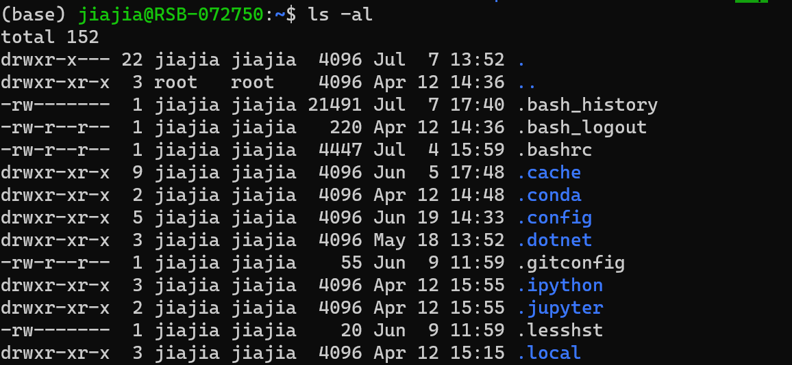
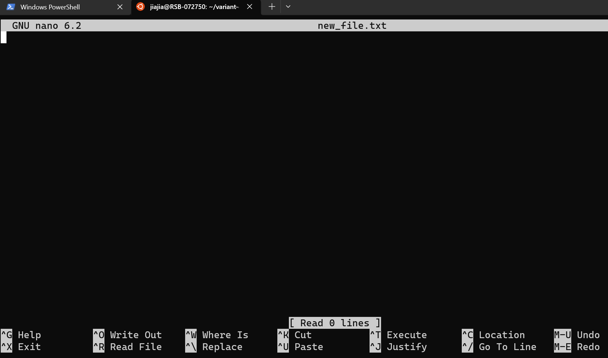
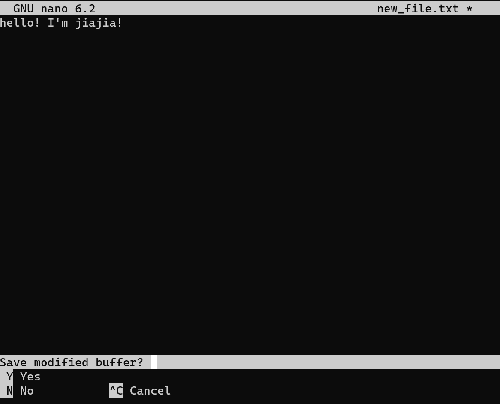
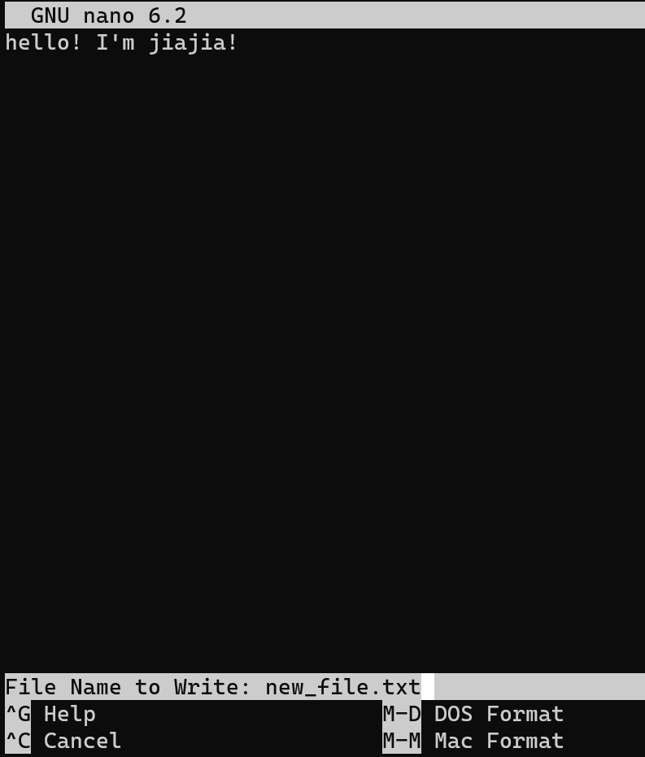
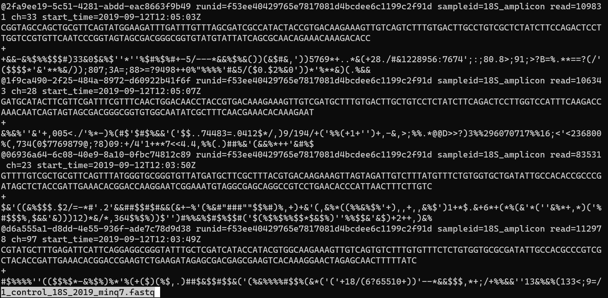
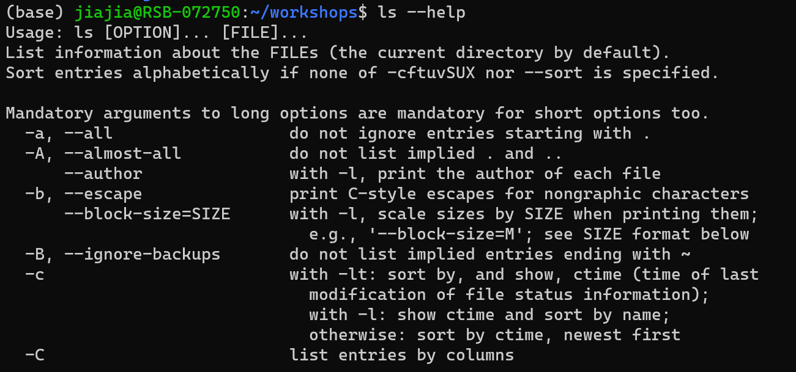

# Workshop 1 - Linux basics 

## Learning objectives 

* Understand what is Linux and how can we use it in biology research
* Understand the concept of command line interface and terminal
* Understand the syntax of Linux commands 
* Understand the Linux file system
* Be able to use commands to go to different directories in Linux
* Be able to use commands to create, delete, copy, move, and rename files and directories
* Be able to use commands to view and print file contents 
* Be able to use Linux shortcuts and wild cards 

# Linux operating system

## What is Linux? 

Linux is a free and open-source operating system that is widely used in various computing devices. 

People often asking "Who is using Linux? I don't see Linux in our life". __(Do you know who is using Linux?)__ 

Linux is everywhere, from personal computers to servers, mobile devices, embedded systems, and more. It was created by Linux Torvalds in 1991 and is based on the Unix operating system. Popular Linux distributions include Ubuntu, Debian, Fedora, Redhat, and CentOS. 

## What is Unix?

You might have heard a lot about Unix, and it is used a lot interchangeably with Linux. But do you understand the relationships between them? 

Unix is a family of multitasking, multiuser computer operating systems originally developed in the 1960s and 1970s at AT&T's Bell Labs. It was designed to be a versatile and powerful operating system for mainframe and later, personal computers. Unix-like operating systems have since been developed and used in various forms, with Linux being one of the most well-known derivatives.

So, Unix is like the parent of Linux. __(Do you know any other Unix-like operating systems?)__

Remember when I asked you to set up your laptop before this class, the MacOS users don't need to do anything and they can use it as Linux directly. __Why is it?__ 

## Linux in biology research 

Linux is extensively used in biology research due to its versatility, robustness, and vast collection of software tools and libraries. 

__Bioinformatics__: Linux offers a wide range of powerful tools and software packages for tasks such as sequence alignment, variant calling, genome assembly, gene expression analysis, next-generation sequencing analysis and more. Popular tools include BLAST, Bowtie, SAMtools, BWA, and Genome Analysis Toolkit (GATK). Linux is also popular in the field of molecular modelling, molecular dynamics simulations, and drug discovery. Software packages like GROMACS, AMBER, AutoDock, and VMD are widely used on Linux for tasks such as protein structure prediction, ligand docking, and virtual screening. 

__High-performance computing (HPC)__: Linux is the dominant operating system in the field of high-performance computing. It is commonly used on computer clusters for running computationally intensive bioinformatics analyses, simulations, and large-scale data processing tasks. 

__Server and web hosting__: Linux-based servers are widely used for hosting biological databases, online bioinformatics tools, and web-based resources for researchers and the scientific community.

# Command Line Interface (CLI)

A command-line interface is a text-based interface used to interact with a computer operating system or software by typing commands into a terminal or command prompt. In a CLI, users communicate with the computer through text commands rather than using graphical user interfaces (GUIs) with windows, menus, and buttons.

In a CLI, users typically enter commands as text strings followed by pressing the Enter/Return key to execute the command. These commands are interpreted by the operating system or software, which then performs the requested actions or provides the desired information. 

__Please open a new terminal.__

You may see something like this:


This is your command line interface, it may look slightly different depending on your device but they share the similar elements.

* __User name__: before the @ sign is your user name. For the example figure, the user name is `jiajia`.
* __Device name__: after the @ sign is your device name. For the example, the device name is `RSB-072750`.
* __Your location__: after the colon and before the $ sign is your location on the device. For the example, the location we are at is `~` which means the home directory. 
* __Command to run__: after the $ sign is where you type the command. 
* __Environment name (optional)__: at the beginning of the command prompt with a bracket, it means the environment you are in. It only shows when you have installed a environment management software on your device, such as Conda or Mamba. For the example, the environment name is `base`. 

Below is also a good example image, you can try the command `date` in there. 

 

# Linux commands and syntax 

__Q: what are the ways you interact with a Windows/MacOS?__ 

## Linux commands 

In Linux, the only way to interact with the system is through the command line. Different commands perform different tasks, and a command can be very simple or very complicated. In this class, we will start with the simple and useful commands. 

## The syntax of Linux commands 

A Linux command is usually composed of 3 different parts, and they are separated by a space character. 

 

* __Command__: the command to perform a certain task.
* __Option/Flag__: to add functions on the command to perform the task slightly differently. 
* __Argument__: a file/location which we want our command to perform on. 

__Please try the command in the above image.__ 

* Options and arguments are optional for some commands, some commands can run only by itself. For example, you can run `ls` just by itself. 
* You can use more than one options for a command. For example, `ls -F -a` also works. 
* It is also possible to have more than one argument for a command, but it depends on commands. For example, `ls -F / /mnt` works as well. 

# Linux file system 

File system is the structure and organisation of files and directories. In Linux, the files system starts from the root directory `/` and branches out into subdirectories and files. 

 

Because there is no graphic user interface (GUI) for Linux, we can imagine a tree-like organisation to help us understand the relationships between directories. 

* __Root directory `/`__: root directory is the top-level directory and serves as the starting point of the file system hierarchy. All other directories and files are located within the root directory or its subdirectories. 
* __Path__: a path is a string that represents the location of a file or directory within the file system. For example, a path may look like this `/home/jiajia/data/sample_1.fasta`

## Absolute vs Relative Path 

A path can be either absolute or relative. An absolute path starts from the root directory `/`, while a relative path is specified relative to the current directory. 

In Linux, we use `.` to represent the current directory and `..` to represent the parent directory. 

__Q: What is the absolute path of the directory `scripts`?__

__Q: If we are in the directory `/home/mary`, what is the relative path to the directory `robert`?__

## Mouse does not work in terminal

This is one thing to pay attention to before we move on to practising commands. 

When you type commands in the command line, you can only use the arrow keys to move your cursor. 

# Commands to move around in Linux 

When we log into a Linux system, we are in the home directory `~` by default. What exactly is this `~` directory? We can use the command `pwd` to check out. 

## `pwd` - Path of Working Directory

This command tells your current directory. 


From the figure we can see we are in the `~` directory, and by using the command `pwd` we know that our home directory is `/home/jiajia`. The path to home directory is different for each user. 

## `ls` - Listing 

This command lists all the things in your current directory. 


For now, it will return nothing for you because you are a new user and haven't create anything under your home directory. As we mentioned above, we can put a path as the argument to `ls` to list all the things under that path. 

__Use `ls /` to list everything under the root directory.__


__Exercise: list everything under the `/home` directory.__

`ls` has many useful options to look at out files with more details. I'll list a few here:

* `ls -l`: list with long format 
* `ls -a`: list all files including hidden files start with `.`

You can combine two options together and type it in this way: `ls -al`, it means to list all files including hidden files in long format. 



## Long format file information explain 


By default, the file sizes shown are in bytes format, we can use the option `-h` in `ls` to make it shows in KBs, MBs, and GBs. 

__Exercise: list all files including hidden files in long format and human readable size.__ 

## `cd` - Change Directory 

This command lets you go to other directories in Linux. You can use either absolute or relative path as the argument to this command.

* Use absolute path go to `/home` directory: `cd /home`
* Use relative path to go to `/home` directory: `cd ..`

Then, go back to your home directory using `cd ~`.

# Create files and directories

## `mkdir` - Make Directory 

This command lets you create a new directory. 

This command takes a new directory name as the argument. For example, to create a new directory named `variant-calling` under our current directory, we can use the command `mkdir variant-calling`. 

## `touch` - To create empty files 

This command lets you create empty files, it takes the file name as the argument. For example, if I want to create a new empty file called `new_file.txt` I can run `touch new_file.txt`.

__Exercise: change directory to `variant-calling` and create a new file called `new_file.txt`.__

After we create the new empty file, how do we edit it like we edit it in Windows/MacOS? 

## Text editors 

Like in Windows and MacOS, Linux also has many different types of text editors and you can choose the one you like to use. Here, we will introduce one easy to use text editor called Nano. 

## Text editor `nano`

`nano` takes the file name as the argument. To edit the file `new_file.txt` we just created, we can run `nano new_file.txt`. After you run the command, you will go into the text editor interface. 



In here, you can type the things you want. 

At the bottom of the interface, there are some shortcuts for functions. 

`^G` means pressing `ctrl` key and `G` key together to get the help manual, and `M-U` means pressing `alt/cmd` and `U` keys togehter. In the help manual, there is a list of shortcuts for different functions. 

__Type something in the file.__

To save and exit the editor, use the `^X` shortcut. You will be prompted with 2 questions. 

The first question would ask you "Save Modified Buffer?", it's asking you if you want to save the things you have edited. Press `y` or `n` to answer.



The second question is asking you what name do you want to save this file as, if you don't want to change the file name, simply press `enter`. If you want to change the file name, you can delete the text and type the new file name. 



# Read file contents 

Now we have successfully created a file and input some things in. How do we read the file?

Of course we can use the same `nano` text editor to open the file and read it. But there are more ways to display or read a file in Linux.

## `cat` - Print file contents 

This command prints out a file's all content on the screen, it takes the file name as an argument. To print out the `new_file.txt`, we can run `cat new_file.txt`. 


But in reality, files can be really big and the content is long. We wouldn't want to print out everything on the screen. In those situations, we can use the command `less`.

## `less` - View file contents

This command allows you to view the contents of a file in a scrollable manner, enabling you to navigate through large files easily. 

First, let's download a large file for us to view. 

```sh
# wget is a command to download files from the internet 
wget https://zenodo.org/record/3736457/files/1_control_18S_2019_minq7.fastq
```

The downloading process should look like this:


After downloading, we can use `less 1_control_18S_2019_minq7.fastq` to view the content of the fastq file. When you type the file name, you can press `tab` key to auto-complete the file name. 

You will go into an interface with file content displayed:



In this interface:
* We can use arrow keys to scroll up/down/left/right line by line.
* We can also use the `space` key to scroll down page by page. 
* Press `q` to exit the interface. 
* Use `/string` to search a pattern. 

## `head` and `tail` - Print the beginning or end of a file 

These 2 commands allows you to print the beginning or end part of a file, it prints out 10 lines of contents by default. 

You can try `head 1_control_18S_2019_minq7.fastq` and `tail 1_control_18S_2019_minq7.fastq`. 

To specify a certain number of lines to view, we can use the option `-n`. For example, to print out the first 20 lines of the file, we can run `head -n 20 1_control_18S_2019_minq7.fastq`. Similar with `head`, you can use `-n` option with `tail` too. 

# Remove files and directories 

## `rmdir` - Remove empty directories

This command allows you to remove empty directories, it cannot remove directories with files in it. 

__Exercise: create an empty directory and remove it.__

## `rm` - Remove files 

This command allows you to remove files, it takes the file name as an argument. To remove the file `new_file.txt`, we can run `rm new_file.txt`. 

## `rm -r` - Remove directories with files inside 

The `-r` option with command `rm` allows you to remove directories that have files inside. 

__Exercise: create a directory with files in it, and use `rm -r` to remove them all together.__

# Move, rename, and copy files and directories 

## `mv` - Move files and directories

__Syntax__: `mv /path/to/source /path/to/destination`

This command works on both files and directories, you don't need an option to move directories. If there is an existing file that has the same name with your source file, the `mv` command will overwrite the existing file.

__Exercise: move `1_control_18S_2019_minq7.fastq` to your home directory and move it back.__ 

__Exercise: create a new directory `workshops` in your home directory, and move the directory `variant-calling` into `workshops`.__

## `mv` - Rename files and directories

In Windows or MacOS operating systems, move a file and rename a file seems are different things. But in Linux, it shares the same command. 

__Syntax__: `mv old_name.txt new_name.txt` 

__Exercise: rename file `1_control_18S_2019_minq7.fastq` to `sample_1.fastq`.__

## `cp` - Copy files 

__Syntax__: `cp /path/to/source /path/to/destination`

If you would like to make a duplicate of a file in the same folder, you can run `cp existing_file.txt new_name.txt`

For example, to make a duplicate of `sample_1.fastq` and name it `sample_1_copy.fastq`, we can run `cp sample_1.fastq sample_1_copy.fastq`

## `cp -r` - Copy directories

The `-r` option with `cp` allows you to copy a directories with everything inside. 

# Some useful tricks in Linux 

## `--help` - Getting help with a command 

If you want to learn a new command or if you forgot the options for a command, you can use the `--help` option to read the manual. 

For example, if I want to learn more about how to use `ls`, I can run `ls --help`.



## `history` - Get the history of recently used commands 

This command makes it easier to search for commands in the history and copy-paste to reuse it. 

## Shortcuts 

* `tab` key to complete file and directory names
* `↑` key to get the previous command, and the previous command of the previous command
* `ctrl + c` to terminate running process 
* `clear` command to clear terminal
* `exit` command to exit from the current shell 

## Wild Card

Linux provides 2 wildcard characters to represent ambiguous characters or strings in file or directory names. 

* The question mark `?` represents any single character. For example, `ls file?.txt` would list `file1.txt` and `file2.txt` but not `file50.txt`. 
* The asterisk `*` represents any string of 0 or more characters. For example, `ls file*.txt` would list `file.txt`, `file1.txt`, `file2.txt`, and `file50.txt` but not `file01.data`. 
