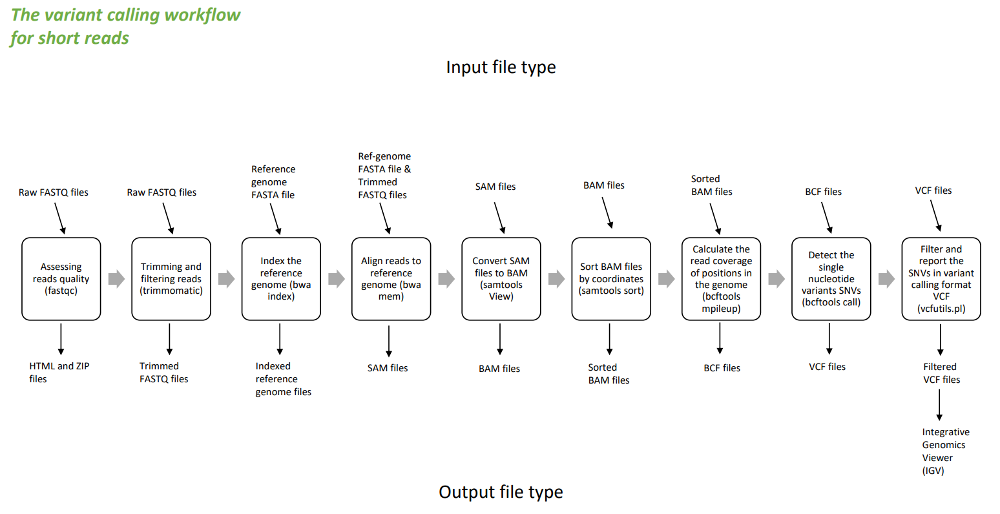

# Workshop 3 - Variant calling workflow 

## Learning objectives 

* 
* 

# Variant calling 

## What is variant calling?

Variant calling is a bioinformatics process used in genomics to identify genetic variations between the genome of an individual and a reference genome. These variations can include single-nucleotide polymorphisms (SNPs), small insertions and deletions (indels), and larger structural variants. 

In this workshop, our variant calling workflow will only detect SNPs. For finding indels or larger structural variants, the workflow will change a bit. 


## The data 

* The data we are going to use is part of a long-term evolution experiment led by [Richard Lenski](https://en.wikipedia.org/wiki/E._coli_long-term_evolution_experiment). 
* The experiment was designed to assess adaptation in E. coli. A population was propagated for more than 40,000 generations in a __glucose-limited__ minimal medium (in most conditions glucose is the best carbon source for E. coli, providing faster growth than other sugars). This medium was supplemented with __citrate__, which E. coli cannot metabolise in the aerobic conditions of the experiment. 
* Sequencing of the populations at regular time points revealed that spontaneous citrate-using variant (__Cit+__) appeared between 31,000 and 31,500 generations, causing an increasing in population size and diversity. 

We will be working with 3 sample events from the Ara-3 strain of this experiment, one from 5,000 generations, one from 15,000 generations, and one from 50,000 generations. The population changed substantially during the course of the experiment, and we will be exploring how with our variant calling workflow. 

We have downloaded the files, and it should be in our `~/workshops/variant-calling/raw-fastq/` directory. Let's go into that directory and have a look.

```sh
cd ~/workshops/variant-calling/raw-fastq/
ls
```

You should see:


You might notice that our fastq files have the .gz extension behind, it means it's a compressed file and we need to decompress it. The command for decompress a .gz file is `gunzip`. 

To decompress all of our 6 files:

```sh
gunzip *.fastq.gz
```

As we learned the last time, `*` wild card can represent filenames, and we can use it to decompress 6 files in one line of command. It takes several minutes to run. After it finish running, you can use `ls` to check the decompressed files. 


Then, we can use the `ls -lh` to have a look of how big is our files. 


## Paired-end sequencing 

You might notice that our files contain `_1` and `_2` in the filename, and before that the filenames are the same. It means our sample were sequenced from both ends and it came out as two separate files. In the analysis, we use both of the files. 

## FASTQ file format 

FASTQ format is a text-based format for storing both a biological sequence (usually nucleotide sequence) and its corresponding quality scores. 

It was originally developed to bundle a FASTA formatted sequence and its quality data, but has recently become the de facto standard for storing the output of high-throughput sequencing instruments such as the Illumina Genome Analyzer. 

A FASTQ file has four line-separated fields per sequence:

* Line 1 begins with a `@` character and is followed by a sequence identifier and an optional description.
* Line 2 is the raw sequence letters. 
* Line 3 begins with a `+` character and is optionally followed by the same sequence identifier (and any description) again. 
* Line 4 encodes the quality values for the sequence in line 2, and must contain the same number of symbols as letters in the sequence. 

We can view the first complete read in one of our files by using head command to look at the first 4 lines:

```sh
head -n 4 SRR2584863_1.fastq 
```

And you should see:


Line 4 shows the quality for each nucleotide in the read, the quality here means the base call accuracy (e.g. 90%). Base calling is the method used to decode the raw signals generated during the sequencing process into the corresponding DNA sequence. 

To make it possible to line up each individual nucleotide with its quality score, the numerical score is converted into a code where it uses letters and special characters to represent the score.


# Bioinformatic workflow 

When working with high-throughput sequencing data, the raw reads you get off of the sequencer will need to pass through a number of different tools in order to generate your final desired output. The execution of this set of tools in a specified order is commonly referred to as a workflow or a pipeline. 

There are 9 steps for our variant calling workflow, and we will learn it step by step with hands-on coding exercise. 



## 1. Assessing quality using FastQC 

In real life, you will not 


# References

* Wikipedia - [FASTQ format](https://en.wikipedia.org/wiki/FASTQ_format) 
* Data Carpentry - [Data Wrangling and Processing for Genomics](https://datacarpentry.org/wrangling-genomics/index.html)
