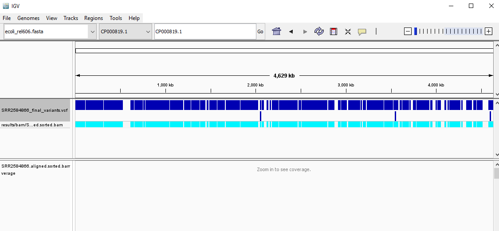
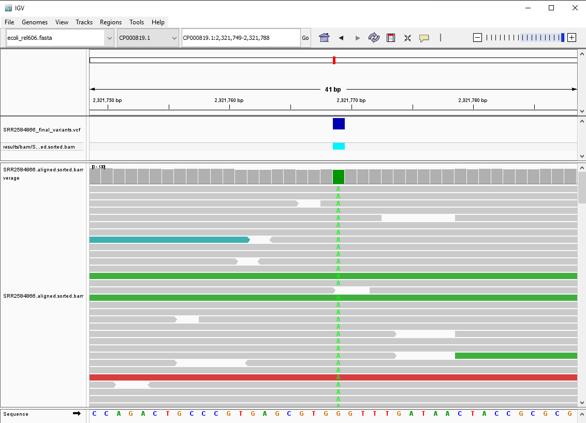

# Workshop 5 - Result Visualisation & Shell Script 

## Learning objectives 

* Understand what is a genome browser and what it does
* Be able to index BAM files
* Be able to load reference genome, vcf files, and BAM files into IGV
* Be able to understand the meaning of different tracks and components
* Understand what is a shell script and what it does
* Be able to write and run a shell script 
* Be able to combine the variant calling workflow into a single script 
* Be able to connect to a remote server via ssh 

## 1. Viewing the variant calling results in a genome browser

A genome browser is a graphical interface for displaying information for genomic data. Genome browsers enable users to visualise and browse entire genomes with annotated data, including gene prediction, gene structure, protein, expression, regulation, variation, and comparative analysis.

The [Integrative Genomics Viewer](https://software.broadinstitute.org/software/igv/) (IGV) is a stand-alone browser, which has the advantage of being installed locally and providing fast access. Web-based genome browsers, like [Ensembl](https://www.ensembl.org/index.html) or the [UCSC browser](https://genome.ucsc.edu/), are slower, but provide more functionality.

It is often instructive to look at your data in a genome browser. Visualisation will allow you to get a "feel" for the data, as well as detecting abnormalities and problems. Also, exploring the data in such a way may give you ideas for further analyses.

For example, the variant calling software can't always detect large insertions. It often shows as a bump on the coverage track. 

### 1.1. Indexing BAM file

IGV requires that BAM files have an associated index file. We can use `index` command from SAMtools. 

```sh
samtools index [aligned.sorted.bam]
```

__Exercise: please index all 3 samples.__ 

### 1.2. Load files into IGV 

Next, we can start to visualise our data. 

1. Open IGV.
2. Load our reference genome file `ecoli_rel606.fasta` into IGV using the "Load Genomes from File ..." option under the "Genomes" pull-down menu.
3. Load our BAM file `SRR2584866.aligned.sorted.bam` using the "Load from File ..." option under the "File" pull-down menu.
4. Do the same with our VCF file `SRR2584866_final_variants.vcf`.

Your IGV browser should look like:



There should be two tracks: one corresponding to our BAM file and the other for our VCF file.

Try zoom in using the scale at the top-right corner to inspect the variants. It should look like this:



__Exercise: try click different components and see what information you get?__

### 1.3. Import multiple samples

IGV allows you to import multiple alignment together and compare them. 

__Please load all 3 of our samples into IGV and compare them.__

Did you find anything interesting? 

For more information about IGV, you can read this [page](https://software.broadinstitute.org/software/igv/AlignmentData). 

## 2. Shell Script 

A shell script is a text file that allows you to combine your sequence of commands together and run it all at once. If you have the need to run the same commands repeatedly, it is a good idea to consider writing a shell script so you can use it the next time. 

We use `.sh` extensions to represent shell script. 

There are 3 steps included to write and run a shell script:

* Create a new file
* Write the code
* Run the script 

__1. Create a new file__

```sh
cd ~/workshops/variant-calling
nano first_script.sh
```

__2. Write the code__ 

We are going to create an interactive conversation for this script. 

Please input the following code to the file:

```sh
echo "Hello!"
sleep 1 
echo "I'm Ubuntu. What's your name?"
sleep 1
read NAME
sleep 1
echo "Hello $NAME, nice to meet you!"
```

The `sleep` command introduces a pause in the execution of a script, the system basically sleep for a period of time before execute the next command. 

```sh
sleep 5 # pause for 5 seconds
sleep 2m # pause for 2 minutes
sleep 1h30m # pause for 1 hour and 30 minutes 
sleep 1d # pause for 1 day 
```

The `read` command reads input from a user and assign it to a variable.

__3. Run the script__ 

To run the script, first we need to save the script. Then we can run:

```sh
sh [/path/to/file]
```

__Exercise: try run `first_script.sh`.__

## 3. Writing a script for the variant calling workflow 

Now we have learned all the necessary steps to write and run a shell script. Please use sample `SRR2589044` as example, write every step of the workflow and put them into a shell script and run it. 

## 4. Connect to RSB computing cluster 

In order to connect to the RSB server, you have to connect to the School Intranet using GlobalProtect VPN or you are connecting via a school EtherPort. 

### `ssh` - Secure Shell

The `ssh` command is used for secure remote access to a remote system or server over a network. It provides encrypted communication between the client and the server. The command to connect to a remote server is:

```sh
ssh [username@hostname]
```

__Please connect to our school server Wright (the hostname will be provided in the class).__ 

__Please set up the conda environment on Wright, Anaconda is installed on server so you don't need to install it.__ 

# Homework

Write a shell script for the variant calling workflow, from the very beginning quality control until you get the final variants. Use for loop to loop through samples. 

Remember when we ran the trimming and filtering step of the workflow, we used for loop to run all our samples at once. I have changed a little bit of the script to make it look neat. 

```sh
for i in *_1.fastq
do
base=$(basename $i _1.fastq)

fastq1=${base}_1.fastq
fastq2=${base}_2.fastq
trim1=${base}_1.trim.fastq
trim2=${base}_2.trim.fastq
untrim1=${base}_1un.trim.fastq
untrim2=${base}_2un.trim.fastq

trimmomatic PE $fastq1 $fastq2 \
                $trim1 $untrim1 \
                $trim2 $untrim2 \
                SLIDINGWINDOW:4:20 MINLEN:25 ILLUMINACLIP:NexteraPE-PE.fa:2:40:15

done
```

# References 

* Melbourne Bioinformatics - [Introduction to Genome Browsers](https://www.melbournebioinformatics.org.au/tutorials/tutorials/Genome_browsers/GenomeBrowsers_Intro/)
* Data Carpentry - [Data Wrangling and Processing for Genomics](https://datacarpentry.org/wrangling-genomics/index.html)
* TechTarget - [shell script](https://www.techtarget.com/searchdatacenter/definition/shell-script) 
* Guru99 - [Shell Scripting Tutorial: How to Create Shell Script in Linux/Unix](https://www.guru99.com/introduction-to-shell-scripting.html)